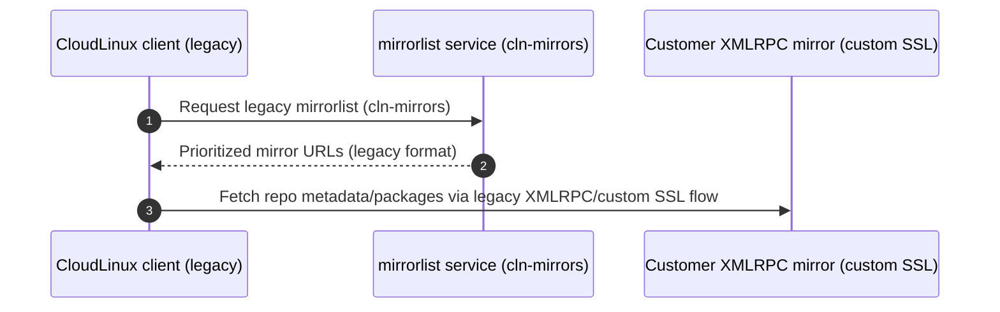
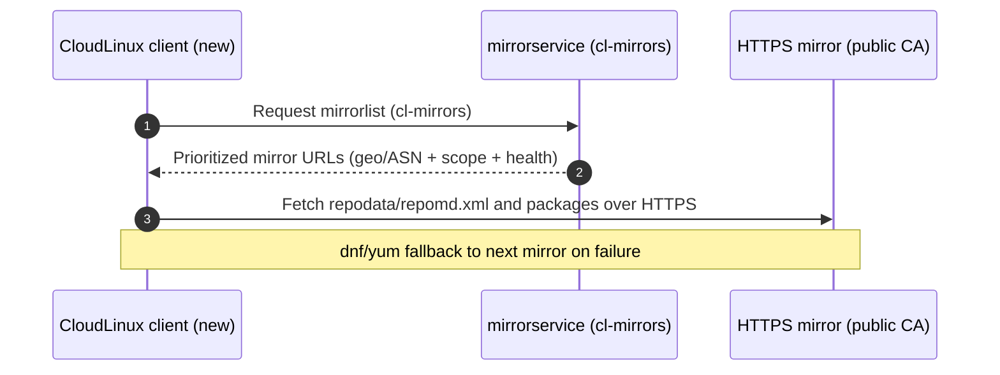

# Internal System Overview (REA&IT)

This document is for internal use by REA&IT and related teams. It summarizes the current CloudLinux mirroring system, the transition from legacy mirrors, and the internal services used to manage mirrorlists.

## Table of Contents

- [Why We Are Moving to the New System](#why-we-are-moving-to-the-new-system)
- [Key Terms (System Glossary)](#key-terms-system-glossary)
- [How It Works (Old vs New Request Flows)](#how-it-works-old-vs-new-request-flows)
  - [Legacy flow (XMLRPC/custom SSL)](#legacy-flow-xmlrpccustom-ssl)
  - [New flow (open HTTPS + mirrorlist)](#new-flow-open-https--mirrorlist)
  - [Client-side identification (quick checks)](#client-side-identification-quick-checks)
- [Host Types in the System](#host-types-in-the-system)
- [Internal Services](#internal-services)
- [Operational Model (Mirrorservice + Partial Mirrors)](#operational-model-mirrorservice--partial-mirrors)
- [Operational Runbook (Internal)](#operational-runbook-internal)
- [Transition Overview (Old to New Mirrors)](#transition-overview-old-to-new-mirrors)
- [Teams Involved](#teams-involved)
- [References](#references)
- [Operational Notes](#operational-notes)

## Why We Are Moving to the New System

- Remove repository/mirror-side authentication and keep license validation **inside CloudLinux OS only**.
- Eliminate the **custom SSL certificate** workflow.
- Remove **CLN-proxy** request flows from the mirror path.
- Reduce **firewall complexity** and the need for whitelisting on customer-owned mirrors.
- Enable customers to **create and manage their own mirrors** more easily.
- Make mirroring more **flexible and customizable** for different customer needs.

## Key Terms (System Glossary)

- **SWNG repository (SWNG)**: The **main operational repository** for CloudLinux systems. It contains the packages used for day-to-day operation and receives regular security, bugfix, and feature updates.
- **XMLRPC mirrors (legacy)**: Old mirror setup using yum-rhn-plugin/XMLRPC with custom SSL certificates bound to customer domains.
- **Non-XMLRPC mirrors (new)**: New mirror setup using standard HTTPS with public certificates (no XMLRPC).
- **`repo.cloudlinux.com`**: Main public repository for conversion/installation assets and legacy content; also serves mirrorlist endpoints.
- **Release repos**: Source-of-truth repositories hosted at:
  - `release.swng.cloudlinux.com:/swng.cloudlinux.com` (SWNG source)
  - `release.repo.cloudlinux.com` (source for `repo.cloudlinux.com` data)
  - Data is maintained by the **Userspace** team; releases are deployed by the **Buildsystem** team.
- **reposync**: Sync mechanism/service used to mirror content from release repos to `upstream.cloudlinux.com` and legacy XMLRPC mirrors.
- **mirrorservice**: Service that returns a location-aware mirrorlist for clients.
  - Old endpoint: `https://repo.cloudlinux.com/cloudlinux/mirrorlists/cln-mirrors`
  - New endpoint: `https://repo.cloudlinux.com/cloudlinux/mirrorlists/cl-mirrors`
- **upstream**: `upstream.cloudlinux.com` unified endpoint for SWNG and `repo.cloudlinux.com` content.

## How It Works (Old vs New Request Flows)

This section describes the **end-to-end request path** from a CloudLinux system to repository content for both the legacy and new approaches.

### Legacy flow (XMLRPC/custom SSL)

- Client stack: **yum-rhn-plugin / RHN tooling** using **XMLRPC transport**.
- Mirrorlist endpoint: `https://repo.cloudlinux.com/cloudlinux/mirrorlists/cln-mirrors`
- Mirror access: customer-provided domains that must serve a **custom SSL certificate** (legacy contract).



### New flow (open HTTPS + mirrorlist)

- Client stack: standard `dnf/yum` repositories using `mirrorlist=`.
- Mirrorlist endpoint: `https://repo.cloudlinux.com/cloudlinux/mirrorlists/cl-mirrors`
- Mirror access: standard **HTTPS** with a **public CA certificate** (e.g., Let's Encrypt). Content is browsable with normal HTTP tooling.



### Client-side identification (quick checks)

Use these to quickly determine which flow a system is on.

- **Legacy indicators**
  - `/etc/sysconfig/rhn/up2date` contains `mirrorURL=` pointing to legacy mirrorlist / XMLRPC flow.
  - Old mirrorlist endpoint is in use: `.../mirrorlists/cln-mirrors`
- **New indicators**
  - `.repo` files (typically `/etc/yum.repos.d/cloudlinux.repo`) contain `mirrorlist=https://repo.cloudlinux.com/cloudlinux/mirrorlists/cl-mirrors`
  - Repository URLs are plain HTTPS and browsable (no XMLRPC transport)

Quick commands:

```bash
# New flow: look for cl-mirrors in dnf/yum repo configs
grep -n "mirrorlists/cl-mirrors" /etc/yum.repos.d/cloudlinux.repo 2>/dev/null || true
grep -R "mirrorlists/cl-mirrors" /etc/yum.repos.d/ 2>/dev/null || true

# Legacy flow: look for mirrorURL (XMLRPC legacy)
grep -R "^mirrorURL=" /etc/sysconfig/rhn/up2date 2>/dev/null || true

# Ask mirrorservice directly (shows which endpoint you're hitting)
curl -sS "https://repo.cloudlinux.com/cloudlinux/mirrorlists/cl-mirrors" | head -n 20
curl -sS "https://repo.cloudlinux.com/cloudlinux/mirrorlists/cln-mirrors" | head -n 20
```

## Host Types in the System

- **Release repos (release hosts)**: Source of truth for SWNG and `repo.cloudlinux.com` data, and the upstream feed for `upstream.cloudlinux.com`.
- **`upstream.cloudlinux.com` (upstream endpoint)**: Load-balanced entrypoint that hides multiple upstream hosts.
- **`repo.cloudlinux.com` (public repository)**: Public endpoint serving repository content and mirrorlist endpoints.
- **CloudLinux-owned mirrors**: High-availability public mirrors that serve as a global fallback when customer-owned mirrors are unavailable.
- **Customer mirrors**: Mirrors managed by customers; can be public or private and can be partial (version-scoped).

## Internal Services

### Mirrorservice (cl-mirrors)

- Repository: `https://reait.gitlab.atm.svcs.io/rea-it/cl-mirrors`
- Purpose: generate mirrorlists based on GeoIP/ASN proximity and mirror availability.
- Output: a prioritized list of mirrors appropriate for the requester.
- Supports both **public** and **private** mirrors.
- Supports **partial mirrors** with version-scoped visibility.
- Mirrors can be **scoped to specific IP ranges** via the mirrorservice, so only those networks receive the mirrorlist entry and **no client-side repository changes are required**.
- The mirrorservice returns **multiple mirrors** in priority order, so if the first (dedicated) mirror is unavailable, clients automatically fall back to the next entries.
- The mirrorservice performs **repository health checks** and returns **only healthy mirrors** in its output.
- Customers are encouraged to **set up and manage their own mirrors**; we only validate mirror health and include them in the mirrorservice.
- If needed, CloudLinux can **deploy and manage mirrors on behalf of customers**.

## Operational Model (Mirrorservice + Partial Mirrors)

### Mirrorservice behavior (expected contract)

- **Input**
  - Requester IP (used for GeoIP/ASN proximity and private-scope selection)
  - Requested repository context (e.g., SWNG vs `repo.cloudlinux.com` content)
- **Output**
  - A prioritized list of **base URLs** that clients try in order (standard `dnf/yum` mirror behavior).
- **Selection order (high level)**
  - **Private mirrors first** (if request IP matches the configured scope)
  - Then **public mirrors** by proximity/capacity signals
  - Always include **fallback entries** (CloudLinux-owned mirrors) for availability
- **Client-side caching**
  - Clients typically re-fetch mirrorlists as part of repo metadata refresh (e.g., controlled by `metadata_expire` in `.repo` configs).

### Mirror health (recommended checks)

Applies to the **new mirror system only**. Legacy XMLRPC/custom-SSL mirrors follow a different contract and are not covered by these checks.

The exact health-check implementation is owned by the mirrorservice, but mirrors should be expected to pass at least these checks:

- **TLS**: valid public CA certificate, no expiry/mismatch.
- **HTTP**: repository roots and metadata are accessible without authentication (200/3xx as expected).
- **Metadata**: `repodata/repomd.xml` is reachable for each mirrored subtree/version.

### Partial mirrors (definition and intent)

- **What “partial” means**
  - A mirror may carry only **some versions / subsets** of SWNG or `repo.cloudlinux.com` trees (to reduce storage/bandwidth).
- **Why this matters**
  - Mirrorservice must return mirrors that actually contain the requested version/path, otherwise clients will see 404/repodata failures.
- **How to represent scope**
  - Version/subtree scope is managed in mirrorservice configuration (customers often provide it as `swng_options` in communications).

### Old Mirrorservice (dyn-mirrors)

- Playbook: `https://reait.gitlab.atm.svcs.io/repositories/repo-inventory/-/blob/main/playbooks/dyn_mirrors.yaml`
- Purpose: legacy mirrorservice configuration used with XMLRPC mirrorlists.

### Upstream Repository Endpoint

- `upstream.cloudlinux.com` is a **new unified public endpoint** (not used in the legacy system) for mirroring:
  - **SWNG** (operational repository)
  - **repo.cloudlinux.com** content (conversion, installation assets, legacy packages)
- Supports **HTTP/HTTPS** browsing and **RSync** for both **full** and **partial** mirrors.
- No authentication is required for downloads.
- Base paths:
  - `https://upstream.cloudlinux.com/swng/`
  - `https://upstream.cloudlinux.com/cloudlinux/`
- RSync endpoint and modules:
  - `rsync://rsync.upstream.cloudlinux.com/`
  - Modules: `SWNG`, `CLOUDLINUX`

### Deployment Playbook for CloudLinux-Owned Mirrors

- Playbook: `https://reait.gitlab.atm.svcs.io/repositories/repo-inventory/-/blob/main/playbooks/non_xmlrpc_mirrors.yaml`
- Purpose: deploy and manage CloudLinux-owned mirrors with standard HTTPS access.
- CloudLinux-owned mirrors must be **high-availability** and act as **global fallback** if customer-owned mirrors are unavailable.
- Deployment includes **monitoring** and **reposync** setup.
- Monitoring dashboard: `https://reait-mon.corp.cloudlinux.com/grafana/d/afb1bbcopcf0gc/non-xmlrpc-mirrors-utilisation?orgId=1&from=now-6h&to=now&timezone=browser`

## Transition Overview (Old to New Mirrors)

The new mirroring system is gradually replacing the old one.
The new mirroring flow currently start with **CloudLinux 10**; support for older versions will be enabled gradually.

**What is changing:**
- **Non-XMLRPC mirrors** replace XMLRPC mirrors, so customers can fully set up and control mirrors.
- **New mirrorservice endpoint**: `https://repo.cloudlinux.com/cloudlinux/mirrorlists/cl-mirrors` replaces `https://repo.cloudlinux.com/cloudlinux/mirrorlists/cln-mirrors`.
- **Automatic client transition**: the mirrorlist URL is updated automatically by `rhn-client-tools` and `cloudlinux-release` package updates.
- **Partial mirrors supported**: mirrors can contain only specific OS versions.
- **Autonomous install/conversion**: `repo.cloudlinux.com` content can be freely synced, enabling fully autonomous installs/conversions when needed.

**Old vs new mirrorlist endpoints:**
- **Old (`cln-mirrors`)**: required for yum-rhn-plugin/XMLRPC flow; configured via `mirrorURL` in `/etc/sysconfig/rhn/up2date`.
- **New (`cl-mirrors`)**: used with standard `mirrorlist=` entries in `.repo` files (same model as AlmaLinux).
- These endpoints are **not interchangeable**.

**XMLRPC vs non-XMLRPC mirrors (not interchangeable):**
- **XMLRPC mirrors** use customer-provided domains bound to **custom SSL certificates** for XMLRPC compatibility.
- **Non-XMLRPC mirrors** use standard HTTPS with public certificates (e.g., Let's Encrypt) and no XMLRPC.
- A single **FQDN / endpoint** cannot serve both XMLRPC and non-XMLRPC flows because it cannot present both the **custom SSL certificate** and a **public CA certificate** for the same legacy contract at the same time.
- Systems that **have not updated** `cloudlinux-release` / `rhn-client-tools` **cannot use new mirrors**, and systems on older packages **must stay on old mirrors**.
- Because CloudLinux does **not control customer update cadence** or know which fleets have migrated, we **cannot unilaterally switch** customer-owned mirrors to the new flow.

**Mirrorlist behavior (legacy overview):**
- Client requests a mirrorlist, gets a sorted list based on proximity.
- Client tries the first mirror; if it fails, it moves to the next.
- Mirrorlist is load-balancing at the service level based on requester IP.

## Operational Runbook (Internal)

### Adding or updating a customer mirror in mirrorservice

Collect (minimum set):
- Mirror base URL(s) (HTTPS), e.g. `https://mirror.example.com/swng/` (and optionally `/cloudlinux/`)
- Public vs private (if private: IP ranges / ASNs / networks)
- Geo location (country/city), expected capacity/bandwidth
- Full vs partial; if partial: list of versions/paths mirrored (often provided as `swng_options`)
- Expected sync method and frequency

Preflight checks (from REA&IT side, before enabling in rotation):
- Mirror is reachable over HTTPS, has a valid public CA certificate, and supports directory browsing or at least direct file access.
- Repository metadata is accessible (e.g. `repodata/repomd.xml` resolves for expected subtrees).
- For private mirrors: validate that the scope rules match the customer networks.

Example preflight commands:

```bash
# Mirror root reachability and TLS
curl -fsSI "https://mirror.example.com/swng/" || exit 1

# Metadata presence (example for CL10 x86_64 SWNG; adjust per scope)
curl -fsSI "https://mirror.example.com/swng/10/x86_64/repodata/repomd.xml" || exit 1

# Mirrorservice output (sanity check)
curl -sS "https://repo.cloudlinux.com/cloudlinux/mirrorlists/cl-mirrors" | head -n 50
```

Post-change verification:
- From an IP inside the intended customer scope, request `cl-mirrors` and confirm the mirror appears near the top.
- Confirm fallback still exists (public/CloudLinux-owned mirrors present).

### Common issues (internal triage)

- **Customer says “mirror is not used”**
  - Client may still be on `cln-mirrors` legacy flow (packages not updated).
  - Mirror may be out due to health-check failures.
  - Private scope may not match the customer’s actual egress IPs.
- **Mirror disappears intermittently**
  - Flapping health (timeouts/403/404), expired certificate, CDN/WAF blocks, or stale/partial subtree mismatch.
- **404/repodata errors on clients**
  - Base path mismatch (missing trailing slash / wrong nginx `alias`), or mirror does not carry the requested version (partial scope not aligned).

## Teams Involved

- **Userspace**: Creates OS code, utilities, and conversion scripts published to SWNG and `repo.cloudlinux.com`.
- **Buildsystem**: Builds and releases packages to SWNG and `repo.cloudlinux.com`.
- **REA&IT**: Provides tooling and maintains public repositories, mirrorservice, endpoints, and hosts (sync, SSL, load balancers, etc.).
- **Support Team**: Customer communication and diagnostics of issues on customer hosts.

## References

- Legacy mirror documentation: `https://cloudlinux.slite.com/api/s/PiwDcKDi3HyxF7/SWNG-mirrors`
- Related docs in this repo:
  - Customer guide: `docs/upstream.cloudlinux.com-customer-guide.md`
  - Support summary: `docs/support-team-notes.md`
  - Mirroring HOWTOs and examples: `README.md`, `docker/`, `ansible/`

## Operational Notes

- SWNG should be the default mirror target for production environments.
- `repo.cloudlinux.com` can be synced to enable autonomous installs/conversions.
- Full `repo.cloudlinux.com` is >3 TB; partial sync is recommended in most cases.

